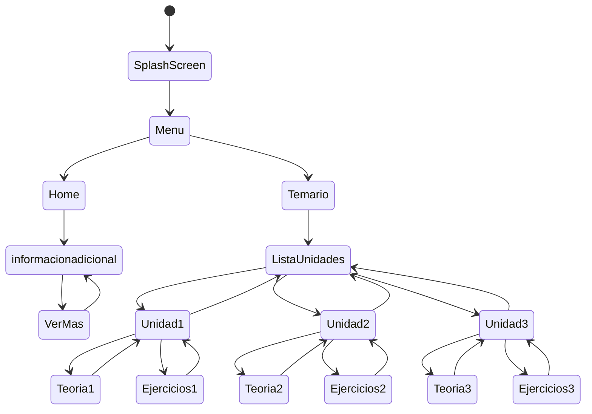

# C2 Studio.

Descripción: Esta aplicación está diseñada como una herramienta de apoyo para los estudiantes que cursan la asignatura de Cálculo II. Su objetivo principal es facilitar el aprendizaje de los contenidos del ramo, especialmente en los temas que suelen resultar más complejos una vez que se introduce el estudio de las integrales.

##Características

## Menú Principal

- Barra de navegación inferior con 2 opciones: Inicio y Buscar.

## Página de Inicio

- Mensaje principal: "Bienvenido a C2 Studios".
- Subtítulo: "Cosas que debes manejar antes de estudiar Cálculo 2".
- Carrusel de temas previos: Derivadas, Límites y Trigonometría.
- Tarjeta destacada con botón "Ver más" que muestra información extra.
- Acceso al temario desde la parte inferior.

## Temario de las Unidades
**Tres unidades principales de Cálculo II:**

**1. Integrales Indefinidas**

- Métodos de integración (sustitución, partes, fracciones parciales, etc.).
- Aplicación práctica: calcular funciones a partir de su derivada.

**2. Integral Definida**

- Integral de Riemann, teoremas fundamentales.
Áreas, volúmenes, integrales impropias.
- Aplicación práctica: áreas irregulares, volúmenes de tanques, distancias.

**3. Series**

- Convergencia y divergencia.
Series geométricas, telescópicas, p-series.
Series de Taylor y Maclaurin.
- Aplicación práctica: aproximación de funciones.

## Tarjetas de Unidades

Cada unidad aparece como una tarjeta con:

- Imagen representativa.
- Título con fondo de color teal.
- Botón "Abrir" para ver más detalles.

- Diseño horizontal y desplazable.

## Detalle de las Unidades

Cada unidad se organiza en un timeline con: 

- ¿De qué trata?: Explicación sencilla.
- Lo que aprenderás: Lista de temas con viñetas.
- En la práctica: Ejemplos de aplicación real.
- Botones para Teoría y Ejercicios (en desarrollo).

## Pila De Tecnologia.

**Client:** Flutter, Android.

## Diagrema De State.

This project is a starting point for a Flutter application.
A few resources to get you started if this is your first Flutter project:

- [Lab: Write your first Flutter app](https://docs.flutter.dev/get-started/codelab)
- [Cookbook: Useful Flutter samples](https://docs.flutter.dev/cookbook)

For help getting started with Flutter development, view the
[online documentation](https://docs.flutter.dev/), which offers tutorials,
samples, guidance on mobile development, and a full API reference.
