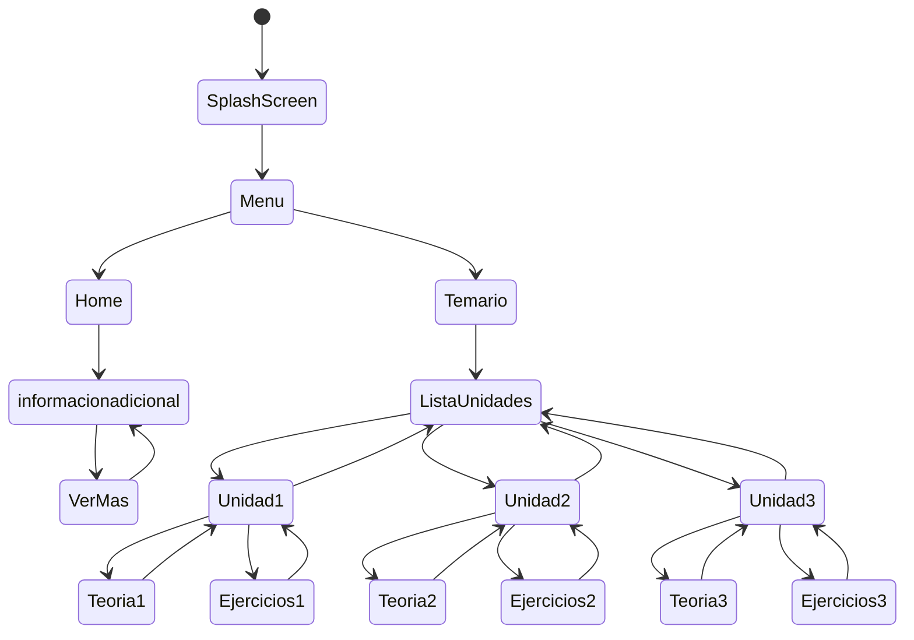

# C2 Studio.

Descripción: Esta aplicación está diseñada como una herramienta de apoyo para los estudiantes que cursan la asignatura de Cálculo II. Su objetivo principal es facilitar el aprendizaje de los contenidos del ramo, especialmente en los temas que suelen resultar más complejos una vez que se introduce el estudio de las integrales.

## Caracteristicas.

-

-

-

-

-

## Pila De Tecnologia.

**Client:** Flutter, Android.

## Diagrema De State.

This project is a starting point for a Flutter application.
A few resources to get you started if this is your first Flutter project:

- [Lab: Write your first Flutter app](https://docs.flutter.dev/get-started/codelab)
- [Cookbook: Useful Flutter samples](https://docs.flutter.dev/cookbook)

For help getting started with Flutter development, view the
[online documentation](https://docs.flutter.dev/), which offers tutorials,
samples, guidance on mobile development, and a full API reference.
